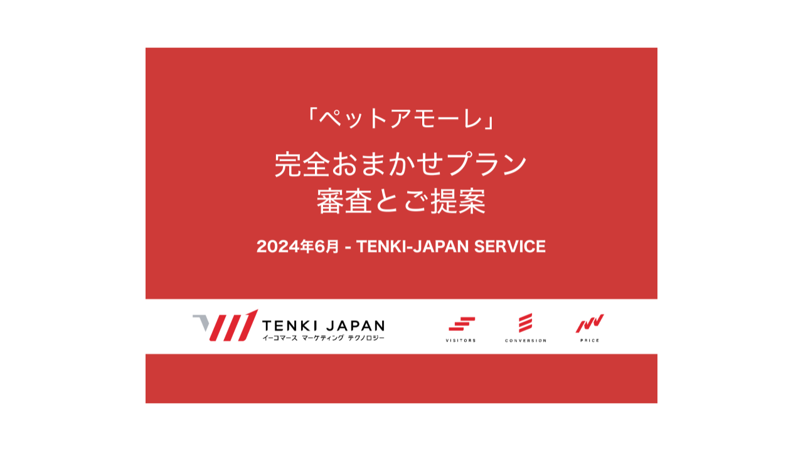
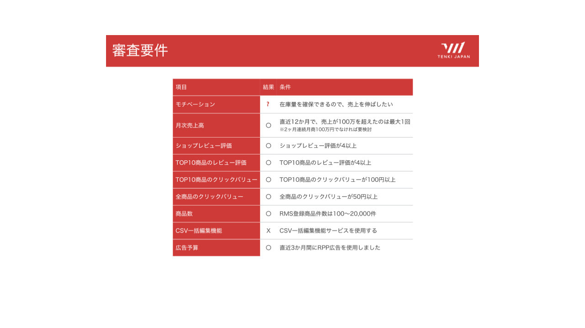
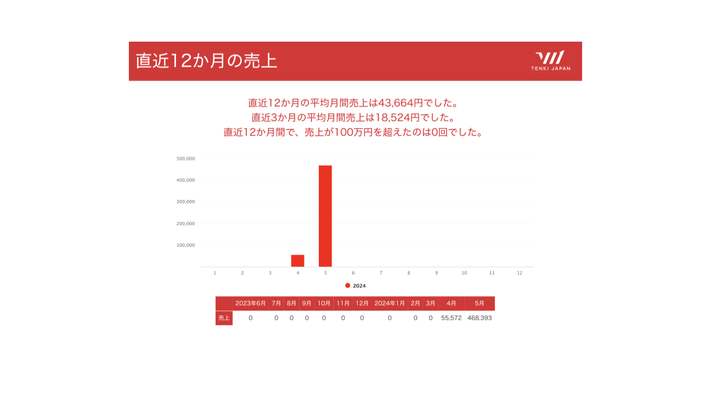
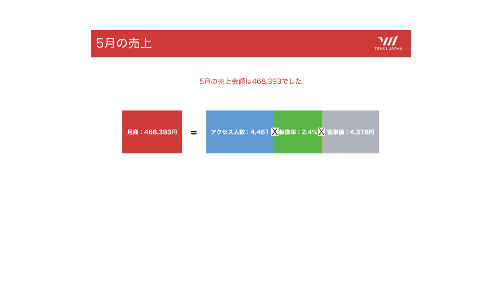
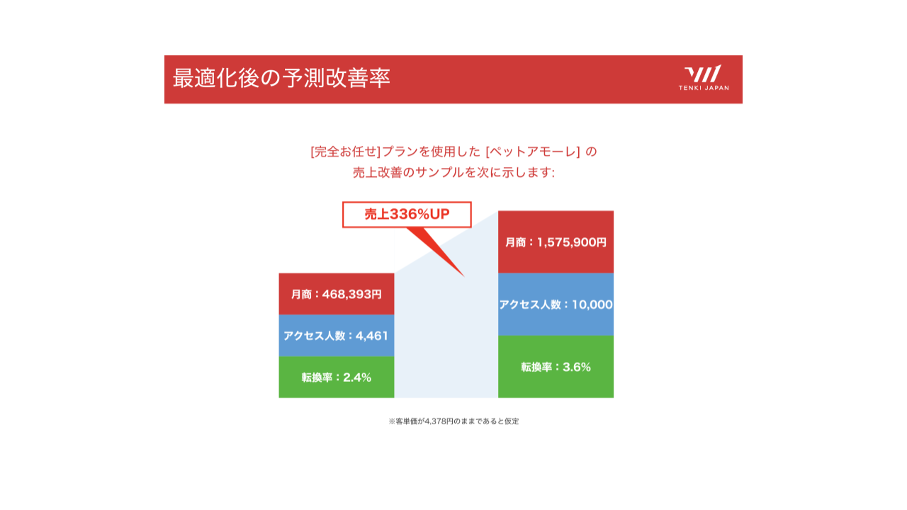
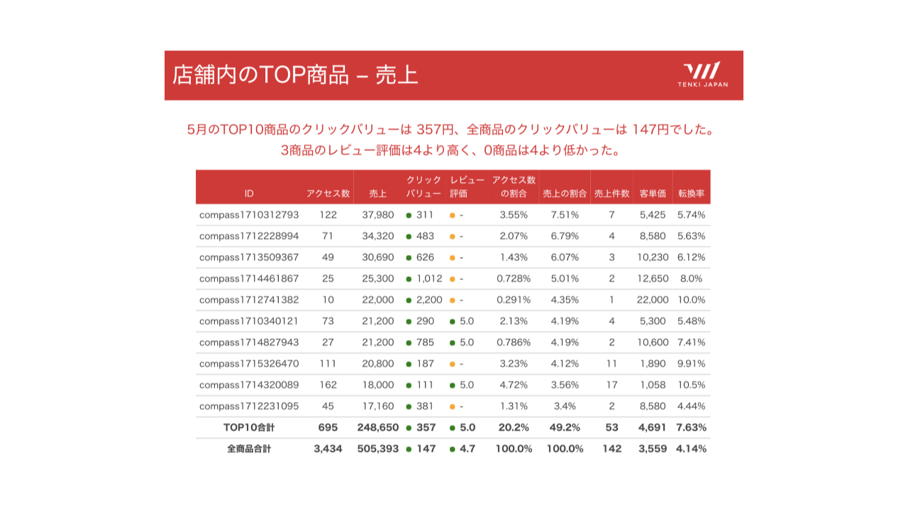
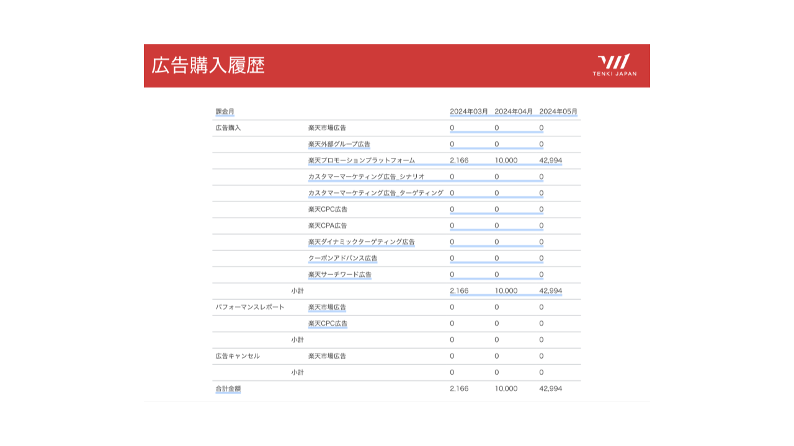
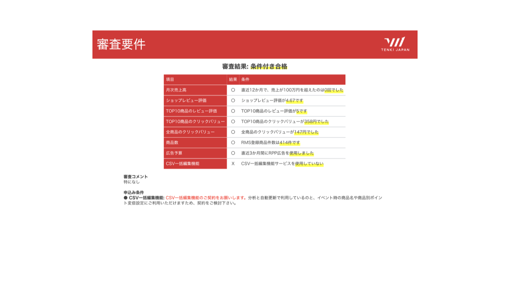
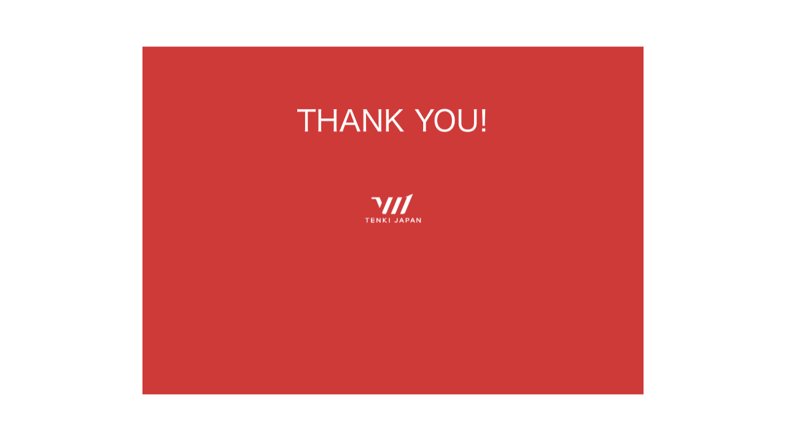

---

size: 720p
voice: takeshi

---

お世話になっております。TENKI-JAPANでございます。
本日は、ペットアモーレ様にご提案する完全おまかせプランの審査結果とご提案内容についてご説明いたします。

---

まず、審査要件についてご説明いたします。こちらの項目に基づいて審査を行いました。モチベーション、月次売上高、ショップレビュー評価、TOP10商品のレビュー評価、クリックバリュー、商品数、CSV一括編集機能の使用、広告予算の項目について審査しました。それぞれの条件をクリアすることで、完全おまかせプランの適用が可能となります。

---

次に審査結果についてご説明いたします。まず直近12か月の平均月間売上は43,664円、直近3か月の平均月間売上は18,524円でした。直近12か月間で売上が100万円を超えた回数は0回となっております。

---

現状を確認します。5月の売上は468,393円で、アクセス人数4,461人、客単価は4,378円でした。このデータをもとに、今後の売上改善の活動を目指してまいります。

---

完全おまかせ-プランで実施するRPP運営及び楽天オートメーションパックの活動、分析レポート提供によるお客様の改善活動を加味した売上改善のサンプルをご案内いたします。あくまで客単価が4,378円の固定であることを前提としております。現在の月商は468,393円ですが、アクセス人数を10,000人、転換率を3.6％に引き上げることで、月商1,575,900円を達成する見込みとなります。売上が336％アップする試算となります。

---

こちらは、5月のTOP10商品のクリックバリューのデータです。TOP10商品のクリックバリューは357円、全商品のクリックバリューは147円でした。また、レビュー評価についても全て4以上となっており、良好な評価を得ています。

---

続いて広告購入履歴の詳細です。2024年3月から5月の間に、RPPの使用実績を確認しました。5月の使用金額は42,994円です。RPPを改善することでより、アクセス数と売上の増加が見込まれます。

---

審査結果について再度ご確認いただきます。月次売上高やレビュー評価、クリックバリュー、商品数、広告予算などの条件を満たしておりますが、CSV一括編集機能をご使用されておりません。CSV一括編集機能を用いて商品データの分析や更新に使用していることで価格を抑えて高品質な運営を実現できるサービスとなっておりますため、さらなる売上の向上のために契約をご検討いただけますと幸いです。

---

以上が、完全おまかせプランの審査結果とご提案内容となります。ご不明点や追加のご質問がございましたら、どうぞお気軽にお問い合わせください。ご清聴ありがとうございました。

